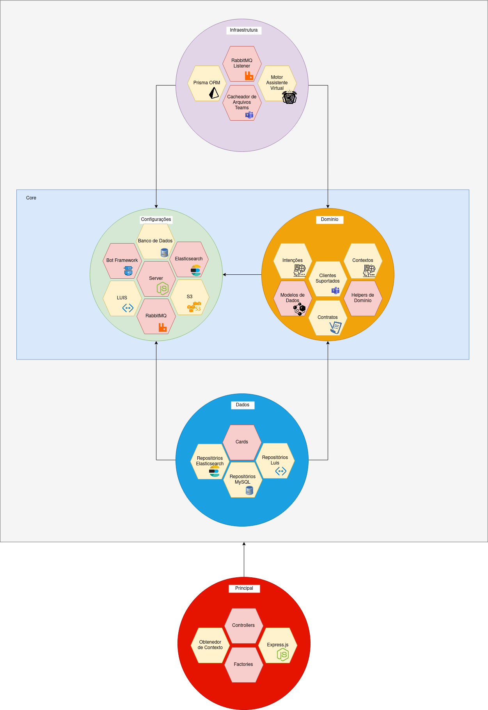

# Atomon Virtual Assistent


Trabalho de conclusão do curso de Sistemas de Informação da FIAP. O Atomon consiste em um assistente virtual responsável por guardar e disseminar informações dentro de uma organização.

## Funcionalidades

- Salvar documentações da organização através do bot;
- Uso de MLP para fazer pesquisas na base de conhecimento da empresa;
- Sistema de gameficação que incentiva o funcionário a popular a base de conhecimento;
- Suporte a anexos;
- Obtenção de informações diretamente pelo Microsoft Teams.


## Arquitetura



## Como Usar

```bash

git clone https://github.com/bruninho51/atomonChatbot.git
npm install
docker-compose up -d
npx prisma generate
npm run start:dev

```

## Integrantes

- Bruno Mendes Pimenta
- Igor Carlos
- Giovana Lopes

<center>Atomon 2021 - Todos os Direitos Reservados</center>